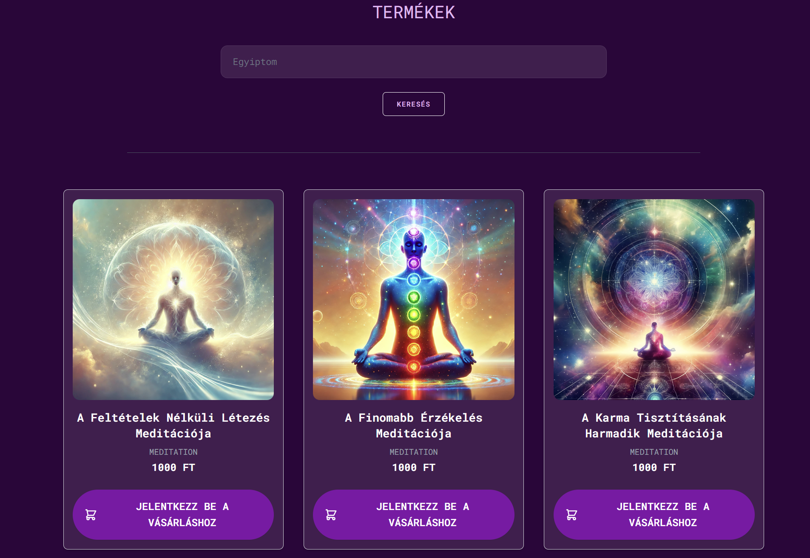

<!-- PROJECT LOGO -->
<br />
<div align="center">
  <a href="https://github.com/othneildrew/Best-README-Template">
    
  </a>
  <h1 align="center">Napszfera</h1>

  <p align="center">
    A webshop for meditations, lectures, and audiobooks, now featuring AI-generated samples!
</p>
</div>

<!-- TABLE OF CONTENTS -->
<details>
  <summary>Table of Contents</summary>
  <ol>
    <li>
      <a href="#about-the-project">About The Project</a>
      <ul>
        <li><a href="#built-with">Built With</a></li>
      </ul>
    </li>
    <li>
      <a href="#getting-started">Getting Started</a>
      <ul>
        <li><a href="#prerequisites">Prerequisites</a></li>
        <li><a href="#installation">Installation</a></li>
      </ul>
    </li>
    <li><a href="#usage">Usage</a></li>
    <li><a href="#stopping-the-containers">Stopping the Containers</a></li>
    <li><a href="#roadmap">Roadmap</a></li>
  </ol>
</details>

<!-- ABOUT THE PROJECT -->
## About The Project
Napszfera was originally created as a webshop for a spiritual teacher to sell meditations, lectures, and audiobooks. 
Customers could purchase these items and download the audio files after payment. 
Although the original project was discontinued, the audio files have been replaced with AI-generated samples to preserve its functionality as an example application.
Napszfera demonstrates how to create an e-commerce platform with seamless payment integration and downloadable digital products.


### Built With
- Backend:  
  [![Laravel.com][Laravel.com]][Laravel-url]
- Database:  
  [![MySQL][MySQL]][MySQL-url]
- Frontend:  
  [![Vite][Vite]][Vite-url]
  [![TailwindCSS][TailwindCSS]][TailwindCSS-url]
- Payment:  
  [![Stripe][Stripe]][Stripe-url]
- Containerization:  
  [![Docker][Docker]][Docker-url]

<!-- CONTACT -->
## Contact

* Pojbics Máté: https://github.com/matet2001 - matet2001@gmail.com  
  [![LinkedIn][linkedin-shield]][linkedin-url]

<!-- GETTING STARTED -->
## Getting Started

To set up the project locally and start using it, follow the steps outlined below.
This section will guide you through the process of preparing your environment, installing necessary dependencies, and running the application.
By the end of this guide, you’ll have the project running on your local machine.

### Prerequisites

Before running the project, ensure you have the following installed:
- Docker, you can install it from this link: https://docs.docker.com/engine/install/
- Docker Compose, you can install it from this link: https://docs.docker.com/compose/install/

### Installation

Here you find the steps of the installation of our project:
1. Clone the repository
    ```
    git clone https://github.com/matet2001/napszfera.git
    cd napszfera
    ```

2. Configure Environment Variables

   To set up your environment variables, simply copy and rename the `.env.example` file to `.env` in the root directory. You can do this using the following terminal command:

    ```bash
    cp .env.example .env
    ```

   Once copied, open the `.env` file and update the values to match your credentials and environment settings. For example:

    ```plaintext
    DB_PASSWORD=yourpassword
    DB_USERNAME=yourusername
    jwtSecret=======================CodeCool=Spring===========================
    jwtExpirationMs=86400000
    ```

   Make sure that the credentials you provide are secure and appropriate for your environment.


3. Run the project with Docker

    Please enter in your terminal the following comment:
    ````
    docker-compose up --build
    ````

   The services will be available at:
   http://localhost

### Usage

Once the services are running, you can access the frontend to explore the webshop and utilize the backend API for examining its functionality.

We have security in place on the website, meaning only logged-in users can access the shop and purchase content. Guests will see limited features. After logging in, users can:

Browse and purchase meditations, lectures, and audiobooks.
Complete secure payments using Stripe.
Download purchased audio files (now replaced with AI-generated samples).
The admin panel (if enabled) can be used for managing products, viewing orders, and monitoring user activity. The project demonstrates a complete e-commerce solution tailored for digital products.





### Stopping the Containers

To stop running  the containers enter the following command:
````
docker-compose down
````

<!-- ROADMAP -->
## Roadmap

- [x] Add blog section and post option for admin
- [x] Admin can upload new products, even with large sizes
- [x] Add Dockerize project
- [x] Add README
- [x] Fill with placeholder data
- [ ] Testing
    - [ ] Set up CI/CD pipeline
    - [ ] Increase coverage with more tests


[Laravel.com]: https://img.shields.io/badge/Laravel-FF2D20?style=for-the-badge&logo=laravel&logoColor=white
[Laravel-url]: https://laravel.com

[MySQL]: https://img.shields.io/badge/MySQL-4479A1?style=for-the-badge&logo=mysql&logoColor=white
[MySQL-url]: https://www.mysql.com/

[Vite]: https://img.shields.io/badge/Vite-646CFF?style=for-the-badge&logo=vite&logoColor=white
[Vite-url]: https://vitejs.dev/

[TailwindCSS]: https://img.shields.io/badge/TailwindCSS-06B6D4?style=for-the-badge&logo=tailwindcss&logoColor=white
[TailwindCSS-url]: https://tailwindcss.com/

[Docker]: https://img.shields.io/badge/Docker-2496ED?style=for-the-badge&logo=docker&logoColor=white
[Docker-url]: https://www.docker.com/

[linkedin-shield]: https://img.shields.io/badge/-LinkedIn-black.svg?style=for-the-badge&logo=linkedin&colorB=555
[linkedin-url]: https://www.linkedin.com/in/m%C3%A1t%C3%A9-pojbics/

[Stripe]: https://img.shields.io/badge/Stripe-635BFF?style=for-the-badge&logo=stripe&logoColor=white
[Stripe-url]: https://stripe.com/

[NGINX]: https://img.shields.io/badge/NGINX-009639?style=for-the-badge&logo=nginx&logoColor=white
[NGINX-url]: https://nginx.org/
